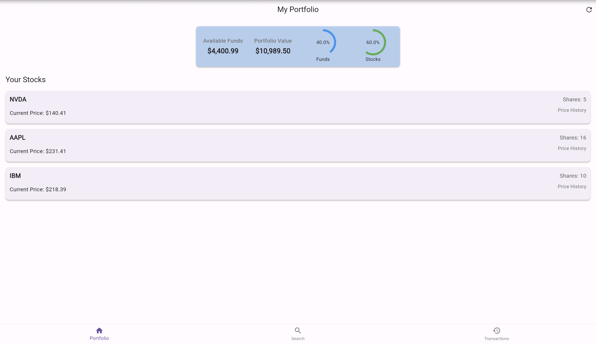
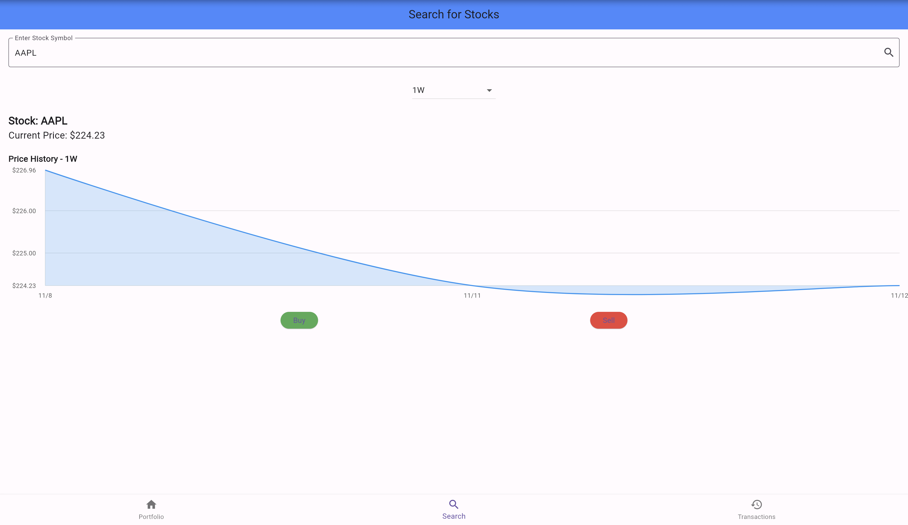
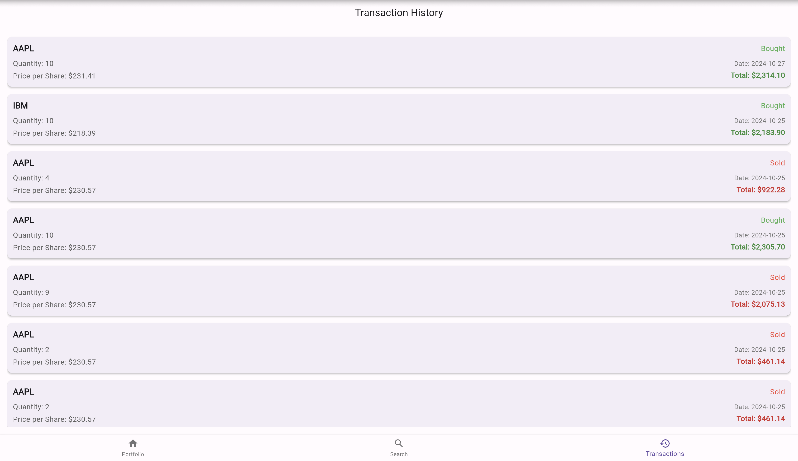

# Stock Trading App 📈

A full-featured stock trading application built with **Flutter** for the frontend and **Node.js** for the backend. The app allows users to manage their stock portfolio, view real-time stock data, perform transactions, and track their overall portfolio performance. With a responsive, intuitive UI, the app is optimized for both iOS and Android, offering a seamless trading experience.

## Web Demo
The app can be accessed [here](https://flutter-portfolio-project.vercel.app/).

#### Portfolio Screen

[//]: # (![Portfolio Screen]&#40;images/portfolio_page.png&#41;)



#### Stock Details Screen



#### Transaction History Screen



## Features

- **User Authentication**: Secure registration and login functionality with JWT authentication.
- **Portfolio Management**: Users can view their available funds, track owned stocks, and view their portfolio’s total value.
- **Real-time Data**: Real-time stock prices and portfolio updates after transactions.
- **Transaction History**: View past transactions and track individual stock performance.
- **Responsive UI**: Designed in Flutter for a smooth, cross-platform experience.
- **Data Security**: Token-based authentication with secure token storage on the device.

## Technologies

- **Frontend**: [Flutter](https://flutter.dev/) - Cross-platform framework for mobile app development.
- **Backend**: [Node.js](https://nodejs.org/) - Serverless API hosted on Vercel, connected to MongoDB Atlas.

## Table of Contents

- [Getting Started](#getting-started)
- [Installation](#installation)
- [Backend Setup](#backend-setup)
- [Frontend Setup (Flutter)](#frontend-setup-flutter)
- [Environment Variables](#environment-variables)
- [Usage](#usage)
- [Folder Structure](#folder-structure)
- [API Endpoints](#api-endpoints)
- [Contributing](#contributing)
- [License](#license)

---

## Getting Started

Follow the instructions below to set up and run the app locally. This guide assumes familiarity with Flutter, Node.js, and MongoDB.

## Installation

### Prerequisites

- **Flutter SDK** (v3.0 or later) - [Installation Guide](https://flutter.dev/docs/get-started/install)
- **Node.js** (v16.x or later) - [Download](https://nodejs.org/)
- **MongoDB Atlas** - [Sign up for a free account](https://www.mongodb.com/cloud/atlas) or install MongoDB locally

---

## Backend Setup

1. **Clone the Repository**:
   ```bash
   git clone https://github.com/tuanvukng01/flutter_portfolio_project.git
   cd flutter_portfolio_project/backend
   ```

2. **Install Dependencies**:
   ```bash
   npm install
   ```

3. **Environment Variables**:
   - Create a `.env` file in the `backend` folder:
     ```plaintext
     SECRET_KEY=your_jwt_secret_key
     DATABASE_URL=your_mongo_db_connection_string
     ```

4. **Start the Server**:
   - Locally:
     ```bash
     npm run dev
     ```
   - Deployment: The backend is optimized for deployment on Vercel. Ensure that your environment variables are set on Vercel's dashboard.

---

## Frontend Setup (Flutter)

### 1. Clone the Repository

```bash
git clone https://github.com/tuanvukng01/flutter_portfolio_project.git
cd flutter_portfolio_project/lib
```

### 2. Install Flutter Packages

```bash
flutter pub get
```

### 3. Configure Environment Variables

Flutter requires a secure way to access sensitive data. For this app, configure your `apiBaseUrl` in a separate `lib/utils/api_constants.dart` file.

```dart
const String apiBaseUrl = "https://your-vercel-backend-url.com";
```

### 4. Run the App

To test on a simulator or physical device:

```bash
flutter run
```

For web support, use:

```bash
flutter run -d chrome
```

> **Note**: Ensure that the `flutter_secure_storage` package is configured correctly for your platform, as it’s used for storing authentication tokens.

---

## Environment Variables

- **Backend (`backend/.env`)**:
  - `SECRET_KEY`: The JWT secret for authentication.
  - `DATABASE_URL`: MongoDB connection string.

- **Frontend (`lib/utils/api_constants.dart`)**:
  - `apiBaseUrl`: URL of the backend API.

---

## Usage

1. **Sign Up / Log In**: Register or log in to your account.
2. **View Portfolio**: View available funds, total portfolio value, and stocks held.
3. **Search Stocks**: Search for stocks and view real-time price data.
4. **Buy / Sell Stocks**: Perform buy/sell operations, updating available funds and portfolio value.
5. **Transaction History**: Review past transactions and portfolio changes.

---

## Folder Structure

The project is divided into `frontend` and `backend` folders for better organization.

- **`lib`**: Contains all Flutter code and assets for the mobile app.
  - **`api`**: API services for communicating with the backend.
  - **`models`**: Data models for User, Stock, and Portfolio.
  - **`providers`**: State management with Riverpod.
  - **`screens`**: Screens for authentication, portfolio, and stock transactions.
  - **`utils`**: Helper functions and constants.
- **`assets`**: Static resources like images and icons.
- **`pubspec.yaml`**: Flutter dependencies and configuration.

- **`backend`**: Node.js serverless functions and API endpoints.
  - **`config`**: MongoDB configuration.
  - **`api`**: Contains `register.js` and `login.js` for authentication.
  - **`.env`**: Environment variables for secure backend configuration.

---

## API Endpoints

### Authentication

- **`POST /api/register`** - Register a new user
  - Request body: `{ "email": String, "password": String, "name": String }`
  - Response: `201 Created`, `{ "message": "Account created", "userId": String }`

- **`POST /api/login`** - Log in an existing user
  - Request body: `{ "email": String, "password": String }`
  - Response: `200 OK`, `{ "message": "Login successful", "userId": String, "token": String }`

### Portfolio

- **`GET /api/portfolio/:userId`** - Fetch portfolio data
  - Requires Authorization header: `Bearer <token>`

---

## Troubleshooting

### Common Issues

1. **CORS Issues**: Ensure that CORS headers are set correctly on the backend.
2. **Environment Variables**: Verify `.env` settings, especially on Vercel.
3. **Flutter Secure Storage**: Make sure `flutter_secure_storage` is properly configured for storing sensitive data.

### Known Limitations

- Real-time stock data is currently fetched from a simulated API. Consider integrating with a live stock data provider for production.

---

## Contributing

Contributions are welcome! Please fork the repository, create a feature branch, and submit a pull request for review.

## License

This project is licensed under the MIT License. See [LICENSE](LICENSE) for more details.

[//]: # (--- )

[//]: # ()
[//]: # (### Screenshots)

[//]: # ()
[//]: # (Add screenshots or GIFs showcasing the app’s UI and functionality for a better user experience in the README.)

---

